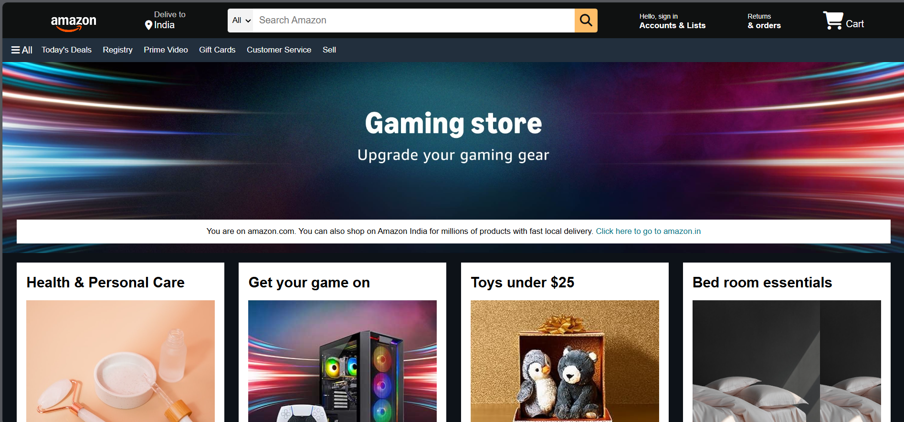

# 🛒 Amazon Clone (HTML & CSS Only)



This project is a **static front-end clone** of the Amazon homepage built using only **HTML** and **CSS**. It recreates the visual layout, styling, and structure of the original site, perfect for learning basic front-end concepts like flexbox, positioning, layout, and responsiveness.

---

## 📁 Project Structure
```
Amazon-Frontend-Clone/
├── index.html 
├── style.css 
├── Final-page.png 
└── Images/ 
```
---

## ✨ Features

- Fully responsive layout (based on Amazon homepage)
- Flexbox-based navbar and product grid
- Custom banner, deals section, and footer
- Clean, semantic HTML structure

---

## 🛠️ Technologies Used

- HTML5
- CSS3 (Flexbox & Positioning)

> No JavaScript. No frameworks. 100% beginner-friendly.

---

## 📷 Preview


---

## 📚 Learnings

This project helped reinforce:

- Layout design using **Flexbox**
- Mastering the **Box Model**
- Recreating real-world UIs
- Writing clean and organized CSS

---

## 🙌 Credits

- Inspired by [Amazon.in](https://www.amazon.in)
- Built as a practice project for front-end development

---

## 📌 License

This project is intended for **educational use only** and is not affiliated with Amazon.

